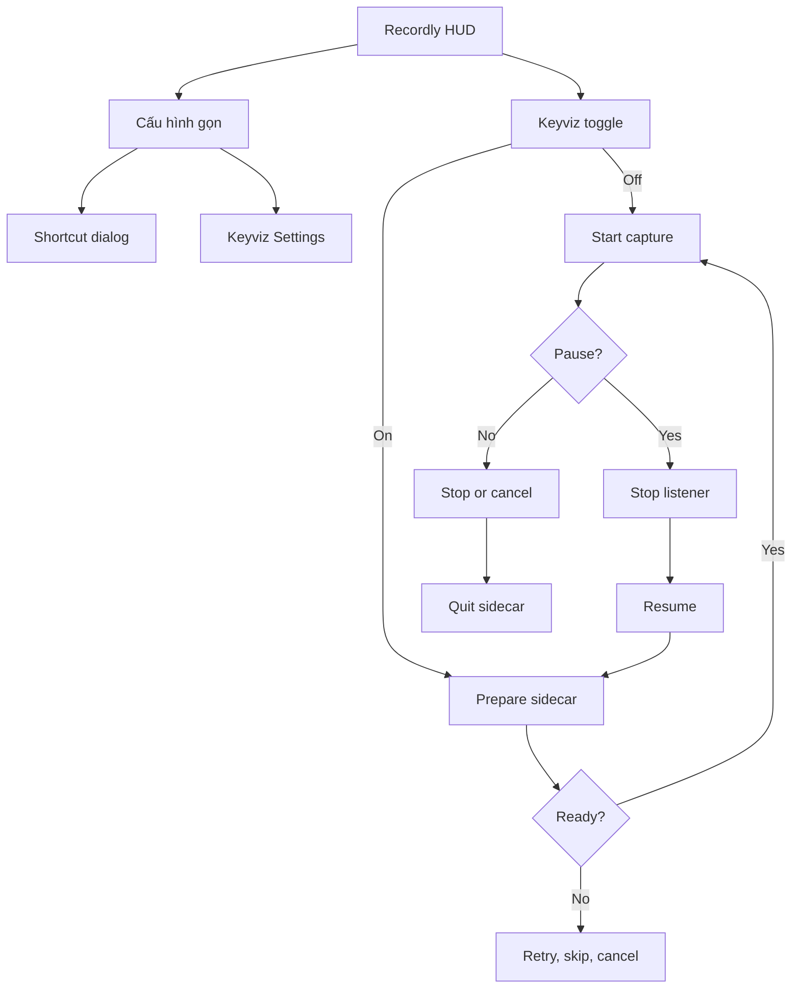

# Spec: Việt hóa và tích hợp Keyviz vào Recordly

## Context Snapshot
- Project / module: Recordly desktop recorder/editor; Keyviz source đã được migrate từ `window\Recordly\keyviz` vào `keyviz/` của checkout canonical, hash 163 file source khớp; old local folder đã được xóa theo yêu cầu user.
- Canonical repository: public fork `https://github.com/nguyendinhquocx/Recordly`, branch `main`; live GitHub page xác nhận fork từ `webadderallorg/Recordly` và đang ahead 8 commits tại thời điểm khảo sát.
- Working checkout: `D:\pcloud\workspace\code\window\recordly-community`; clone từ fork, `origin` là fork của mày và `upstream` trỏ `https://github.com/webadderallorg/Recordly.git`. Source root là Git repo riêng nằm dưới repo cha `window`, được loại khỏi parent status bằng `.git/info/exclude`; hiện `main` chỉ có working spec và Keyviz source chưa commit, chưa có feature code.
- Stack / runtime: Recordly dùng Electron 43, React 19, TypeScript, Vite; package manager theo `package-lock.json`. Keyviz dùng Tauri 2, Rust, React 19; `keyviz/package.json` khai báo pnpm.
- Current behavior:
  - Runtime đăng ký 10 locale và 7 namespace; `DEFAULT_LOCALE` là `en`, locale lưu ở `recordly.locale`, lần đầu còn dò ngôn ngữ hệ thống. Có 11 thư mục locale, trong đó `ru` chưa được đăng ký trong `SUPPORTED_LOCALES`/`I18nContext`; `i18n-check` vẫn quét thư mục này.
  - HUD chuẩn bị quay nằm ở `src/components/launch/LaunchWindow.tsx`; hiện có chọn nguồn, mic, webcam, countdown, record, home và hide/close.
  - Shortcut dialog hiện nằm trong editor, chỉ sửa 6 thao tác editor: Add Zoom = `Z`, Split = `C`, Annotation = `A`, Keyframe = `F`, Delete Selected = `Ctrl+D`, Play/Pause = `Space` trên Windows. Chưa thấy hotkey global start/stop/pause recording.
  - Keyviz là app Tauri độc lập. `rdev::listen` chạy ngay khi app khởi động; trạng thái “off” hiện chỉ chặn phát sự kiện ra UI, không tháo global input listener.
- Desired behavior: Recordly HUD là chỗ chuẩn bị/quay duy nhất; Keyviz có toggle nhanh và cửa sổ cấu hình mở theo yêu cầu; listener chỉ hoạt động lúc recording thực sự chạy; cấu hình shortcut được sửa trước lúc quay; lần đầu mở app là tiếng Việt.
- Relevant files to read:
  - Recordly: `src/i18n/config.ts`, `src/contexts/I18nContext.tsx`, `src/components/launch/LaunchWindow.tsx`, `src/components/launch/LaunchWindow.module.css`, `src/lib/shortcuts.ts`, `src/contexts/ShortcutsContext.tsx`, `src/components/video-editor/ShortcutsConfigDialog.tsx`, `electron/main.ts`, `electron/preload.ts`, `electron/electron-env.d.ts`, `electron-builder.json5`, `THIRD_PARTY_NOTICES.md`.
  - Keyviz: `keyviz/src-tauri/src/lib.rs`, `keyviz/src-tauri/src/app/event.rs`, `keyviz/src-tauri/src/app/state.rs`, `keyviz/src-tauri/tauri.conf.json`, `keyviz/src/pages/settings.tsx`, `keyviz/src/components/settings/`.
- Existing constraints:
  - Chỉ tích hợp Keyviz cho Windows ở revision này; Keyviz Linux mới ở mức thử nghiệm X11.
  - Impeccable xác nhận chưa có `PRODUCT.md`/`DESIGN.md`, nhưng đây là mở rộng HUD hiện có; giữ code/CSS hiện tại làm visual authority, không redesign.
  - Keyviz có LICENSE GPLv3; phải giữ attribution/license và rà nghĩa vụ phân phối trước khi ship installer.
  - Fork clone ở `D:\pcloud\workspace\code\window\recordly-community`. 1,154 file fork tracked trùng byte-for-byte với old source; local copy thiếu 16 file `.github/`, còn 163 file Keyviz source đã được copy/verify byte-identical (generated/build output không copy). Old `window\Recordly` đã bị user yêu cầu xóa; deletions trong repo cha đã được user tự commit chủ đích (`7b7691e0`), còn 4 thay đổi cũ khác vẫn unstaged.

## Objective
- Khi làm video web/product, tao mở Recordly, chỉnh nhanh Keyviz/shortcut trên HUD rồi quay; không phải tự mở thêm Keyviz và không phải đợi vào editor mới cấu hình.
- Thành công là video có overlay phím bấm khi toggle bật; toggle tắt thì không có Keyviz listener/overlay; mọi bước người dùng thấy đều tiếng Việt ở cài đặt mặc định; lựa chọn locale người dùng đã lưu vẫn được tôn trọng.
- Public fork phải build/test được từ checkout sạch theo hướng dẫn trong repo, không dựa vào đường dẫn hay công cụ chỉ có trên máy tao; giới hạn Windows và license Keyviz phải được nói rõ.

## Scope
- In:
  - Thêm tiếng Việt cho toàn bộ giao diện first-party của Recordly và cửa sổ cấu hình Keyviz thuộc bản sidecar; không để phần chính của app rơi về tiếng Anh do key thiếu hoặc text hard-code. Nội dung do extension bên thứ ba cung cấp giữ nguyên theo extension.
  - Lần đầu mở chọn `vi`; nếu đã có locale lưu thì giữ locale đó. Không thêm màn hình hỏi ngôn ngữ lúc khởi động.
  - Thêm toggle Keyviz ngay trên idle HUD, bật mặc định và nhớ lựa chọn; phím off nghĩa là recording kế tiếp không khởi động Keyviz.
  - Mở cửa sổ Settings gốc của Keyviz từ mục cấu hình nâng cao trên HUD. Cửa sổ này không bắt phím; không nhúng lại toàn bộ UI Tauri vào React của Recordly.
  - Cho cấu hình 6 shortcut editor hiện có và 3 thao tác quay mới (start, stop, pause/resume) ngay trước khi quay. Hotkey quay hoạt động global khi Recordly đang chạy.
  - Đóng gói Keyviz sidecar vào bản Windows của Recordly; build và smoke-test artifact, nhưng không tự cài/ghi đè bản Recordly người dùng đang cài.
  - Sau khi mọi gate pass, commit và push branch feature lên fork công khai để cộng đồng xem/dùng; không merge vào `main` hoặc tạo GitHub Release nếu chưa có yêu cầu riêng.
  - Không làm mất cấu hình Keyviz hiện có nếu đọc/migrate được an toàn; không xóa hoặc ghi đè dữ liệu cài Keyviz độc lập.
  - Cập nhật một mục hướng dẫn tiếng Anh trong `README.md` và build/release notes trong `RELEASING.md`: cách dùng, Windows-only limitation, cách build sidecar, cách chạy tests và license; mọi lệnh phải chạy được từ checkout sạch, không chứa absolute path cá nhân.
  - Dọn local copy cũ `D:\pcloud\workspace\code\window\Recordly` sau khi đã migrate và verify `keyviz/`; chấp nhận path cũ bị xóa khỏi parent Git index, các deletions do chính user commit (`7b7691e0`, xác nhận chủ đích 2026-10-09).
- Out:
  - Hỗ trợ Keyviz trên macOS/Linux trong revision này; cài đặt Wayland/X11 ngoài Windows.
  - Viết lại hoặc port UI/keyboard hook của Keyviz sang Electron; làm lại visual world của Recordly.
  - Tự kết thúc process Keyviz độc lập đang chạy, tự cài/ghi đè app đã cài, tạo GitHub Release/PR upstream, hoặc sửa/xóa các thay đổi cũ trong `D:\pcloud\workspace\code\window` ngoài hai path đã chốt: `Recordly/` (dọn sau verify) và `recordly-community/` (repo fork).
  - Viết lại toàn bộ README, dịch tài liệu sang tiếng Việt, publish GitHub Release, mở PR vào upstream hoặc dịch giao diện do extension bên thứ ba cung cấp.

## UX Baseline
1. Keyboard: thứ tự focus trong HUD theo thứ tự nhìn thấy; mở cấu hình phím thì phím bấm được ghi nhận chỉ trong lúc đang ở capture mode; `Esc` thoát capture/đóng popup mà không lưu nhầm.
2. Focus: mọi nút icon-only có focus ring nhìn thấy; không giấu focus để làm HUD “gọn”.
3. A11y: toggle có tên và trạng thái đọc được; icon button, lỗi và trạng thái sidecar có accessible label; contrast text tối thiểu 4.5:1.
4. Viewport: HUD và popover không bị cắt ở cửa sổ/độ phân giải Windows được hỗ trợ; dialog shortcut và Settings không che mất đường quay lại Recordly.
5. States: có trạng thái bật/tắt, đang khởi động, đang quay, tạm dừng, lỗi khởi động và sidecar thoát bất ngờ; lỗi phải có cách phục hồi cụ thể.
6. Consistency: dùng `LaunchWindow.module.css`, launch theme và component hiện có; không thêm bộ UI/CSS thứ hai hoặc hard-code màu mới.
7. Platform: tôn trọng window/overlay convention của Windows; Settings được đưa lên trước khi người dùng yêu cầu; không xuất hiện tray app thứ hai không cần thiết.
8. Copy: mọi label, tooltip, toast, dialog, lỗi và screen-reader text của luồng quay/cài đặt có tiếng Việt tự nhiên; tên phím vật lý như Ctrl/Shift giữ nguyên quy ước.

## Thuật ngữ
- HUD = thanh điều khiển nổi của Recordly ở mép dưới màn hình, hiện có trước và trong lúc quay.
- Keyviz sidecar = executable Keyviz được Recordly đóng gói và tự quản lý vòng đời; vẫn chạy process Tauri riêng, không phải React component nhúng.
- Input listener = hook hệ điều hành nhận sự kiện bàn phím/chuột của Keyviz; chỉ được tồn tại khi một recording đang thực sự chạy.
- Global shortcut = tổ hợp phím do Electron đăng ký để gọi start/stop/pause dù cửa sổ Recordly không có focus.
- Locale đã lưu = giá trị `recordly.locale` người dùng đã chọn; nó thắng default tiếng Việt.
- `ru` locale folder = thư mục hiện có nhưng không được app đăng ký/chọn; giữ nguyên trạng thái đó, nhưng vẫn phải giữ key parity vì checker quét thư mục.

## Assumptions
- “Mặc định on” nghĩa là lần cài mới bật Keyviz; sau khi người dùng đổi toggle, lựa chọn đó được nhớ cho lần quay/app sau.
- Toggle Keyviz chỉ có ở trạng thái chuẩn bị quay. Khi Recordly pause, Keyviz phải dừng; khi resume thì khởi động lại trước khi tiếp tục capture.
- Hướng nhìn giữ nguyên HUD hiện tại: Keyviz bật/tắt là hành động trực tiếp; Shortcut và Settings nâng cao nằm sau một nút cấu hình gọn, không thêm hàng nút làm toolbar phình.
- Sidecar được đóng gói với identity riêng để không va chạm single-instance với Keyviz độc lập; nếu phát hiện Keyviz độc lập đang chạy, Recordly không tự kill process đó.
- Canonical source là public fork `nguyendinhquocx/Recordly`; triển khai trên branch feature từ `main`, không commit thẳng vào `main`.
- Hotkey mặc định đề xuất trên Windows: `Ctrl+Alt+Shift+R` (start), `Ctrl+Alt+Shift+S` (stop), `Ctrl+Alt+Shift+P` (pause/resume). Người dùng đổi được trước khi quay.
- Mọi tổ hợp global của Recordly bị lọc khỏi Keyviz overlay trong lúc recording; các phím khác vẫn hiển thị bình thường.
- Locale vi là default khởi chạy, không phải fallback dịch: key thiếu ở locale khác vẫn fallback về English.

## Open Questions
- Có cần nhập một lần cấu hình từ Keyviz độc lập đang cài không? Khuyến nghị: có, nếu xác định được store đúng; copy không phá hủy, không xóa/ghi đè dữ liệu gốc. Nếu không tìm được store thì dùng cấu hình mặc định của sidecar.
- Bộ hotkey đề xuất ở trên là mặc định để review, chưa khóa; phải báo rõ khi một tổ hợp không đăng ký được thay vì im lặng coi như đã hoạt động.

## Approach
- Chọn: đóng gói Keyviz thành sidecar Windows, điều khiển từ Electron main process qua child-process protocol hẹp; không mở TCP port và không để renderer gọi tiến trình/OS trực tiếp.
- Lý do: Recordly là Electron còn Keyviz là Tauri/Rust. Port Keyviz vào Recordly sẽ kéo theo viết lại input hook, overlay window và toàn bộ settings UI — nhiều bề mặt lỗi hơn việc quản lý một process vốn đã chạy độc lập.
- Sidecar dùng stdio line-delimited JSON, không mở TCP và không gửi raw key event qua protocol. Mode `capture` khởi tạo overlay nhưng chưa hook; sau `ready`, Recordly gửi `start_capture` kèm `suppressed_shortcuts`, đợi `capture_started`, rồi mới start screen capture. Sidecar gửi `capture_failed` có mã/nguyên nhân nếu hook không khởi động được. Pause/stop/cancel gửi `quit` và đợi process thoát; resume spawn lại sidecar. Mode `settings` chỉ mở Settings, tuyệt đối không khởi tạo listener và thoát khi cửa sổ đóng. Sidecar tự thoát nếu parent chết.
- Khi Keyviz bật nhưng không khởi động được: không tự quay như thể overlay đã sẵn sàng. Báo tiếng Việt, cho retry / quay không Keyviz / hủy. Nếu sidecar rớt giữa recording, báo trạng thái và cho phục hồi hoặc dừng-lưu; không giấu lỗi.
- Keyviz dùng settings store của sidecar; nếu migrate config cũ thì chỉ import một lần theo kiểu không ghi đè. Không log hoặc persist nội dung phím đã bắt.
- Global shortcut dùng `globalShortcut` ở Electron main process; cùng một dialog hiện tại chứa nhóm “Phím editor” và “Phím quay”. Lỗi đăng ký hotkey phải hiện cạnh binding để người dùng đổi ngay.
- Pre-lock flow đã được người dùng chốt: toggle Keyviz trực tiếp trên HUD; advanced mở cửa sổ Settings Keyviz; dialog phím tắt truy cập trước khi bấm Record. Không chạy Surf vì đây là native desktop, mở rộng nhỏ trên visual system đã có, không thay direction.

## Diagram

## Bỏ qua
- Không biến cửa sổ Settings thành một bản port React trong Recordly: hai UI sẽ lệch dần theo upstream, trong khi người dùng chỉ cần gọi cấu hình khi cần.
- Không giữ Keyviz chạy ngầm rồi chỉ giấu overlay: `rdev::listen` vẫn nhận input ngoài recording, trái với yêu cầu chỉ bắt phím trong lúc quay.
- Không tự kill Keyviz độc lập đang chạy để tránh phá trạng thái người dùng; báo xung đột và cho họ tự đóng.

## Risks
- Native overlay có thể không xuất hiện trong video nếu vị trí Keyviz nằm ngoài crop của cửa sổ đang ghi. Recordly WGC ghi monitor rồi crop theo window bounds; phải test cả display capture lẫn window capture và chỉ chốt sau khi thấy overlay trong MP4 thật.
- `rdev::listen` là blocking listener; đóng sidecar đúng cách khi pause/stop/app exit là điều kiện để nhả hook. Dùng timeout + hard-kill fallback và test không còn process/hook sau mọi đường kết thúc.
- Global shortcut có thể bị app/OS khác giữ trước. Không chiếm hoặc gỡ hotkey của app khác; hiển thị lỗi binding và cho đổi.
- Tạo thêm executable làm tăng kích thước installer và thêm bước build Rust/Tauri; Windows package phải xác nhận file sidecar nằm ngoài `app.asar` và launch được từ path cài thật.
- Bản Keyviz độc lập có thể đang chạy song song hoặc có config riêng. Phải phát hiện/xử lý duplicate rõ ràng và không tự kill/overwrite.
- Keyviz GPLv3 được phân phối cùng Recordly installer: giữ LICENSE/attribution đầy đủ, cập nhật `THIRD_PARTY_NOTICES.md`, và không tuyên bố đã giải quyết nghĩa vụ pháp lý ngoài phần kiểm tra artifact.
- Post-handoff review (2026-10-09) tìm thêm 2 LOW risk, cả hai đã fix ở commit `2544b438` kèm test: (1) `shortcuts.json` ghi không atomic → chuyển sang `writeProjectFileAtomically` (temp + fsync + rename + .bak); (2) renderer chết giữa lúc capture chord giữ hotkey suspension → main track suspension theo webContents và tự nhả khi `render-process-gone`/`destroyed`.

## Task List

### Task 0: Chốt checkout fork làm source of truth
- Acceptance:
  - Làm trong `D:\pcloud\workspace\code\window\recordly-community`, không tiếp tục sửa thư mục source cũ.
  - `origin` trỏ fork `nguyendinhquocx/Recordly`; `upstream` trỏ `webadderallorg/Recordly`.
  - Sau khi spec được duyệt, tạo branch `feature/recordly-keyviz-integration` từ `main`; không commit thẳng vào `main`.
  - Giữ 16 file `.github/` đang có trên fork nhưng thiếu ở local copy cũ.
  - Keyviz source đã được đưa vào fork, gồm `src-tauri/crates/rdev/**` vì Cargo tham chiếu bằng path; không copy `node_modules/`, `dist/`, `src-tauri/target/` hoặc `src-tauri/gen/schemas/` (generated). Old local folder đã bị xóa sau khi 163 file Keyviz source pass byte-hash verification.
  - Repo cha `window`: deletions của old `Recordly/` do user yêu cầu đã được user commit chủ đích (`7b7691e0`); 4 thay đổi pre-existing khác giữ nguyên unstaged. `recordly-community/` nằm trong parent `.git/info/exclude`.
- Reproduce: `git -C "D:\pcloud\workspace\code\window\recordly-community" status --short --branch; git -C "D:\pcloud\workspace\code\window\recordly-community" remote -v`
- Verify: `origin`/`upstream` đúng URL; old `window\Recordly` không còn; 163 file Keyviz source khớp byte, `LICENSE` và `crates/rdev/Cargo.toml` còn; generated folders bị bỏ; parent đã commit deletions (user chủ đích) và còn đúng 4 thay đổi pre-existing. Sau khi spec được duyệt mới tạo branch feature từ `main`.
- Files:
  - `D:\pcloud\workspace\code\window\recordly-community` — canonical clone của public fork.
  - `D:\pcloud\workspace\code\window\Recordly` — migration source đã xóa sau khi Keyviz source và spec được bảo toàn ở checkout canonical.

### Task 1: Việt hóa Recordly và đặt locale mặc định
- Acceptance:
  - Thêm `vi` vào 7 namespace và runtime locale registry. Có 10 locale đang được app hỗ trợ; 11 locale directories tồn tại vì có thêm `ru` chưa đăng ký. `npm run i18n:check` phải giữ key parity ở mọi thư mục: 11 hiện tại + `vi` mới = 12; không tự thêm `ru` vào runtime support.
  - Cài mới không có `recordly.locale` mở lên tiếng Việt bất kể Windows đang dùng English; locale đã lưu vẫn được ưu tiên và đổi được trong Settings. Locale vi là initial default, còn missing-key fallback cho mọi locale vẫn là English.
  - Các text user-facing trên HUD, editor, settings, dialogs, timeline và lỗi/toast dùng được đều có tiếng Việt; không sót fallback English vì key thiếu.
  - Tên shortcut configurable/fixed, conflict text và aria-label được dịch; `src/lib/shortcuts.ts` chỉ xuất action/translation keys, không phụ thuộc React i18n context.
  - Các locale hiện có không bị đổi hành vi hoặc mất key.
- UX Contract:
  - Surface brief: mở rộng Operate HUD/editor hiện hữu; không đổi visual world.
  - States: locale mới cài = vi; locale đã lưu = giữ nguyên; missing key = bị test bắt, không để app lặng lẽ hiện English.
  - Keyboard/focus/a11y/viewport: theo UX Baseline; không thêm prompt chọn ngôn ngữ ở startup.
  - Copy: dùng cụm từ quen thuộc với luồng quay video; giữ tên phím và technical terms cần thiết.
- Skills: `flow`, `impeccable`, `test`.
- Visual Ref: `src/components/launch/LaunchWindow.tsx`, `src/components/launch/LaunchWindow.module.css`, `src/components/video-editor/SettingsPanel.tsx` và settings locale hiện tại.
- Reproduce: `npm run i18n:check && npm run typecheck`
- Verify: test locale resolution với localStorage rỗng/đã lưu và missing-key fallback về English; rà screenshot HUD, editor Settings, dialog, timeline và lỗi/toast ở locale vi; xác nhận đổi locale vẫn hoạt động.
- Files:
  - `src/i18n/config.ts` — pattern: `SUPPORTED_LOCALES` và `I18N_NAMESPACES`.
  - `src/contexts/I18nContext.tsx` — pattern: bundles, `getInitialLocale`, fallback tiếng Anh; tách initial default `vi` khỏi English fallback.
  - `TRANSLATION_GUIDE.md` — giữ nguyên convention namespace/parity của repo.
  - `src/lib/shortcuts.ts`, `src/components/video-editor/ShortcutsConfigDialog.tsx`, `src/components/video-editor/KeyboardShortcutsHelp.tsx`, `src/components/video-editor/TutorialHelp.tsx` — wire `SHORTCUT_LABELS` và `FIXED_SHORTCUTS` khỏi hard-coded English sang `shortcuts.actions.*`; thêm key `splitClip` và các key global mới, giữ parity ở cả 12 locale directories.
  - `src/i18n/locales/vi/common.json`, `dialogs.json`, `editor.json`, `launch.json`, `settings.json`, `shortcuts.json`, `timeline.json` — mirror cấu trúc `src/i18n/locales/en/`.
  - `src/components/**` — rà text user-facing; theo pattern `useScopedT` trong `src/components/launch/LaunchWindow.tsx`.
  - `scripts/i18n-check.mjs` — checker tự discover mọi locale folder, gồm `ru` và `vi`; giữ parity cho cả 12 thư mục, không sửa checker nếu test hiện tại pass.

### Task 2: Chuẩn bị Keyviz sidecar Windows và Settings mode
- Acceptance:
  - Có Windows x64 sidecar build tái lập được từ checkout sạch; app identity riêng, không va chạm với Keyviz độc lập. `beforeDevCommand`/`beforeBuildCommand` dùng `pnpm run dev`/`pnpm run build`, không gọi npm.
  - `capture` mode dựng overlay ở trạng thái ready nhưng chưa hook; chỉ lệnh `start_capture` mới bật input listener. `settings` mode mở cửa sổ Settings nhưng không khởi tạo listener/tray app nền.
  - Settings Keyviz hiển thị tiếng Việt; không dịch tên phím vật lý.
  - Có protocol stdio JSON theo contract: sidecar gửi `ready`; nhận `start_capture` kèm `suppressed_shortcuts`; trả `capture_started` hoặc `capture_failed {code, message}` nếu hook lỗi. Không có TCP listener và không gửi raw key event qua pipe. `settings` mode không bắt phím; `quit` dừng app/hook sạch.
  - Build lưu license/attribution Keyviz; installer có full license/notice tương ứng.
  - Import config Keyviz cũ (nếu được chốt) không xóa/ghi đè store gốc.
- UX Contract:
  - Settings chỉ mở sau thao tác chủ động; không bật overlay/listener khi user chỉ sửa cấu hình.
  - Settings dùng style sẵn của Keyviz, không redesign; cửa sổ đóng thì quay lại Recordly.
  - Mọi lỗi mở Settings nói nguyên nhân và cách phục hồi bằng tiếng Việt.
- Skills: `impeccable`, `test`, `verify`.
- Visual Ref: `keyviz/src/pages/settings.tsx`, `keyviz/src/components/settings/**`; giữ composition và control hiện có.
- Reproduce: `npm run build:keyviz-sidecar` (script cài deps bằng `pnpm install --frozen-lockfile` trong `keyviz/` ở checkout sạch rồi build Tauri; `beforeDevCommand`/`beforeBuildCommand` cũng dùng pnpm).
- Verify: chạy sidecar ở hai mode; xác nhận hook chỉ bắt đầu sau `start_capture`, settings không hook; ép listener lỗi để nhận `capture_failed` thay vì chỉ chờ timeout; gửi `quit` rồi kiểm tra không còn process; smoke-test Settings, locale, app exit và binary đóng gói.
- Files:
  - `keyviz/src-tauri/src/lib.rs` — pattern: `.setup`, tray, `start_listener`, command handler.
  - `keyviz/src-tauri/src/app/event.rs`, `keyviz/src-tauri/src/app/state.rs` — listener/state hiện tại; không ghi event key ra log.
  - `keyviz/src/pages/settings.tsx`, `keyviz/src/components/settings/**` — màn cấu hình hiện tại.
  - `keyviz/src-tauri/tauri.conf.json`, `keyviz/src-tauri/tauri.windows.conf.json` — window/identifier/bundle và pnpm dev/build commands.
  - `keyviz/src-tauri/Cargo.toml` — local path dependency `crates/rdev` phải còn build được.
  - `scripts/build-keyviz-sidecar.mjs` (mới) — theo pattern build helper trong `scripts/build-native-helpers.mjs`; cài deps bằng pnpm, build rồi stage artifact.
  - `package.json` — thêm script `build:keyviz-sidecar` để chạy flow từ checkout Recordly.
  - `electron-builder.json5`, `THIRD_PARTY_NOTICES.md` — resource Windows và notices.

### Task 3: Thêm Keyviz toggle và lifecycle vào HUD
- Acceptance:
  - Idle HUD có toggle Keyviz trực tiếp, mặc định true và lưu lựa chọn; OFF không tạo sidecar.
  - Khi ON, Recordly khởi động sidecar ở trạng thái overlay-ready nhưng chưa hook; gửi `start_capture`, đợi `capture_started`, sau đó mới capture frame đầu. Overlay có mặt trong MP4 display capture và window capture tại vị trí đã cấu hình.
  - Pause dừng listener; resume khởi động lại; stop/cancel/failure/app exit thoát sidecar. Sidecar tự thoát nếu Recordly parent chết.
  - Settings mở cửa sổ Keyviz native không có listener; đóng cửa sổ quay lại HUD.
  - Sidecar lỗi trước recording thì hỏi retry / record không Keyviz / cancel. `capture_failed` phải phân biệt với timeout chung. Rớt giữa recording phải hiện lỗi và cho phục hồi hoặc dừng-lưu.
  - Nếu Keyviz standalone đã chạy, không tạo overlay kép và không tự kill process đó; báo rõ bước cần làm. Mọi tổ hợp global shortcut start/stop/pause-resume hiện hành cùng phần prefix/history của chúng bị lọc khỏi overlay; phím và tổ hợp demo khác vẫn hiển thị, và binding đổi có hiệu lực từ recording kế tiếp.
- UX Contract:
  - Toggle là control độc lập cạnh cụm countdown/record; icon có tên và state rõ, không đẩy nút Record khỏi vai trò chính.
  - Shortcut và Keyviz Settings nằm trong cùng nút cấu hình gọn; không thêm hai nút settings ngang hàng.
  - States: OFF / ON / starting / ready / paused / startup-error / runtime-error.
  - Khi sidecar khởi động chậm, dùng state chờ gọn; không để Record giả vờ đã bắt đầu.
- Skills: `flow`, `impeccable`, `test`, `verify`.
- Visual Ref: `src/components/launch/LaunchWindow.tsx`, `src/components/launch/LaunchWindow.module.css`, `src/components/launch/popovers/`.
- Reproduce: `npm run typecheck && npm test -- electron/ipc/keyvizSidecar.test.ts`
- Verify: unit test state/lifecycle/timeout/capture_failed/filter; khẳng định combo điều khiển và prefix/history của nó bị lọc trước render còn tổ hợp demo khác vẫn hiện; chạy Windows app thật để quay display và một cửa sổ; mở MP4 kiểm overlay; test ON/OFF, pause/resume, stop/cancel, app exit và child crash.
- Files:
  - `src/components/launch/LaunchWindow.tsx` — pattern: `idleControls`, `CountdownPopover`, `AnimatePresence`.
  - `src/components/launch/LaunchWindow.module.css` — pattern: `.bar`, `.barState`, launch theme.
  - `electron/main.ts`, `electron/preload.ts`, `electron/electron-env.d.ts` — pattern: main-owned IPC và API typing.
  - `electron/ipc/handlers.ts`, `electron/ipc/register/recording.ts` — pattern: IPC registration và quản lý native child process.
  - `electron/appSettingsStore.ts` — lưu preference `keyviz.enabled`, mặc định true.
  - `electron/ipc/keyvizSidecar.ts` và `electron/ipc/keyvizSidecar.test.ts` (mới) — controller/test cô lập process.

### Task 4: Cấu hình shortcut editor và global recording hotkeys trước khi quay
- Acceptance:
  - HUD mở được dialog shortcut trước khi recording; cùng schema/persistence với editor.
  - Dialog có 6 shortcut editor và 3 shortcut recording: start, stop, pause/resume.
  - Global shortcut chạy khi Recordly không focus; start gọi đúng flow có/không Keyviz; stop/pause/resume giữ state nhất quán với nút HUD.
  - Conflict detection bao phủ 6 shortcut editor, 3 global shortcut quay và fixed shortcut; không cho lưu tổ hợp trùng trong app. `globalShortcut.register` thất bại thì binding hiện lỗi và người dùng đổi được. Không gỡ hotkey của app khác.
  - Lựa chọn được lưu, nạp lại ở HUD/editor mà không cần restart; modifier và key labels đúng trên Windows.
- UX Contract:
  - Dialog nhóm rõ “Phím editor” và “Phím quay”; binding là control để bấm ghi phím, có trạng thái đang thu phím.
  - Không thêm màn chọn mode trung gian; save/cancel/reset theo dialog hiện có.
  - Các control global hotkey báo rõ active/unavailable; không giả định chỉ lưu vào file là đã đăng ký thành công.
- Skills: `flow`, `impeccable`, `test`, `verify`.
- Visual Ref: `src/components/video-editor/ShortcutsConfigDialog.tsx` và `src/components/launch/LaunchWindow.tsx`.
- Reproduce: `npm run typecheck && npm test -- src/lib/shortcuts.test.ts electron/ipc/globalShortcuts.test.ts`
- Verify: unit test capture/conflict/persistence/register failure; Windows manual test start/stop/pause khi Chrome có focus; xác nhận chord điều khiển bị lọc khỏi overlay còn phím demo khác vẫn hiển thị.
- Files:
  - `src/lib/shortcuts.ts` — pattern: `SHORTCUT_ACTIONS`, `findConflict`, `formatBinding`, `mergeWithDefaults`.
  - `src/contexts/ShortcutsContext.tsx`, `src/components/video-editor/ShortcutsConfigDialog.tsx` — pattern: load/save qua `electronAPI`, capture phím và xử lý conflict.
  - `src/components/launch/LaunchWindow.tsx`, `src/components/video-editor/EditorWindow.tsx` — chia sẻ dialog/provider giữa HUD và editor.
  - `electron/main.ts`, `electron/preload.ts`, `electron/electron-env.d.ts` — `globalShortcut` phải thuộc main process; renderer chỉ gọi typed IPC.
  - `electron/appSettingsStore.ts`, `electron/ipc/globalShortcuts.ts` và `electron/ipc/globalShortcuts.test.ts` (mới) — persistence/registration.

### Task 5: Gate Windows package và nghiệm thu
- Acceptance:
  - `npm run i18n:check`, typecheck, test liên quan và `npm run build:win` pass.
  - Bản unpacked/installer có sidecar ở ngoài `app.asar`, launch đúng từ thư mục cài thật và shutdown không để process mồ côi.
  - License/notice đầy đủ; app không tự cài/ghi đè bản đang dùng.
  - README và RELEASING giải thích đúng feature, giới hạn Windows, build prerequisites và lệnh build/test; không có local path hoặc machine-specific secret.
  - Sau khi mọi gate pass, thay đổi được commit/push lên branch feature của fork; `main` không bị sửa và không phát hành GitHub Release trong task này.
  - UI evidence (idle HUD ON/OFF, shortcut dialog, Keyviz Settings, recording overlay, startup error, recovery) — bị user waiver 2026-10-09: chỉ giữ UAT "Pass all" trên unpacked build làm bằng chứng.
- UX Contract:
  - Chỉ giữ các control đã chốt; không thêm tính năng phụ khi QA.
  - Bản build có thể cài/test riêng mà không phá Recordly đang dùng.
- Skills: `test`, `verify`, `deploy` (audit artifact; không publish).
- Visual Ref: HUD và dialog incumbent nêu ở Task 3–4; ảnh runtime của bản Windows mới là bằng chứng ship.
- Reproduce: `npm run build:win && npm run smoke:packaged-binaries`
- Verify: cài vào đường dẫn test riêng hoặc chạy unpacked; test user checklist; kiểm process/task manager trước-sau mọi nhánh kết thúc; kiểm MP4 thật; không cài đè bản hiện tại.
- Files:
  - `package.json`, `electron-builder.json5` — pattern: `build:win`, `extraResources`, `asarUnpack`.
  - `scripts/smoke-packaged-binaries.mjs` — mở rộng smoke check cho Keyviz sidecar.
  - `README.md`, `RELEASING.md` — bổ sung cách dùng/build/test đúng ngôn ngữ và convention của repo.
  - `THIRD_PARTY_NOTICES.md`, `keyviz/LICENSE` — bảo toàn notice.

## Multi-agent Assignment

### Safety summary
- Mode: Supervised parallel (2 worker worktree) cho Task 1 + Task 2; Task 3 → Task 4 tuần tự; Task 5 parent solo.
- Max parallel workers: 2.
- Không delegate: push fork (parent duy nhất làm), commit chính trên branch feature (parent merge), quyết định protocol/security.

### File overlap check (pre-dispatch)
- W1 (Task 1 i18n) ∩ W2 (Task 2 sidecar): không overlap. W1: `src/i18n/**`, `src/contexts/I18nContext.tsx`, `src/lib/shortcuts.ts`, `src/components/video-editor/ShortcutsConfigDialog.tsx`, `KeyboardShortcutsHelp.tsx`, `TutorialHelp.tsx`, rà hardcode text trong `src/components/**` (chỉ text/i18n, không thêm control). W2: `keyviz/**`, `scripts/build-keyviz-sidecar.mjs`, `package.json` (chỉ thêm script), `electron-builder.json5`, `THIRD_PARTY_NOTICES.md`.
- W1 ∩ W3 (Task 3 HUD): `LaunchWindow.tsx` — Task 1 KHÔNG đụng LaunchWindow (HUD text đã qua i18n key sẵn; nếu sót hardcode ở LaunchWindow thì ghi lại trong report để Task 3 xử lý chung), tránh same-file race.
- Task 4 phụ thuộc Task 3 (cùng `LaunchWindow.tsx`, `electron/main.ts`, `ShortcutsConfigDialog.tsx`) → tuần tự sau khi merge W1.

### Worker Slice W1 — i18n Việt hóa (Task 1)
Role: Worker; Risk tier: T2; worktree=true.
Files allowed: `src/i18n/**`, `src/contexts/I18nContext.tsx`, `src/lib/shortcuts.ts`, `src/components/video-editor/ShortcutsConfigDialog.tsx`, `src/components/video-editor/KeyboardShortcutsHelp.tsx`, `src/components/video-editor/TutorialHelp.tsx`, `src/components/**` (chỉ text/i18n sweep, không đụng `LaunchWindow*`), `src/i18n/locales/vi/**` (mới), test mới nếu cần.
Files forbidden: `keyviz/**`, `electron/**`, `LaunchWindow.tsx`, `LaunchWindow.module.css`, `package.json`, `electron-builder.json5`.
Verify gate: `npm run i18n:check && npm run typecheck` + locale resolution tests pass.

### Worker Slice W2 — Keyviz sidecar (Task 2)
Role: Worker; Risk tier: T2; worktree=true.
Files allowed: `keyviz/**`, `scripts/build-keyviz-sidecar.mjs` (mới), `package.json` (chỉ thêm script), `electron-builder.json5`, `THIRD_PARTY_NOTICES.md`.
Files forbidden: `src/**`, `electron/**` (trừ không đụng gì), `README.md`, `RELEASING.md` (Task 5 làm).
Verify gate: `cargo check`/`cargo build` trong `keyviz/src-tauri` pass + sidecar binary chạy 2 mode smoke (stdout protocol) + `node scripts/build-keyviz-sidecar.mjs` chạy được từ checkout sạch.

### Thứ tự thực hiện
1. W1 + W2 song song (worktree, base = baseline commit 5f6b6115).
2. Parent scope-check diff từng worker + merge vào `feature/recordly-keyviz-integration`.
3. Parent/worker Task 3 → verify → Task 4 → verify (tuần tự, same-file risk).
4. Task 5 parent solo: build:win, smoke, docs, commit/push.

## Checkpoints
- Sau Task 0: checkout fork nằm đúng path, Keyviz source đã verify; old folder đã xóa; deletions parent được user commit chủ đích (`7b7691e0`). Branch feature `feature/recordly-keyviz-integration` đã tạo từ `main` sau khi user duyệt spec.
- Sau Task 1: i18n parity + locale first-run/save tests pass; chụp HUD và Settings tiếng Việt.
- Sau Task 2–3: build sidecar Windows được; kiểm tra process/hook được nhả sau pause/stop/cancel/parent exit; kiểm MP4 display/window capture.
- Sau Task 4: đăng ký global shortcut và đồng bộ HUD/editor pass; lỗi tổ hợp bị chiếm hiện rõ.
- Trước hoàn tất: Task 5 pass, user test pass (UAT "Pass all" trên unpacked Windows build), `/verify` pass qua 2 reviewer post-handoff; UI evidence pack bị user waiver; chỉ sau đó mới archive spec.

## External Review Brief
### Reviewer cần phán
- UI/flow lens: toggle có gọn, dễ hiểu, đúng vị trí trước Record không; popup Settings/shortcut có làm toolbar phình hoặc tạo thêm bước thừa không; tiếng Việt có phủ hết luồng không.
- Architecture/security lens: sidecar chỉ bắt input lúc recording; settings mode không hook; parent crash/child crash/timeout/duplicate Keyviz được xử lý; protocol không mở TCP hoặc log key data.
- Capture lens: overlay có thật sự vào được MP4 cho cả display và window crop; cấu hình vị trí có giới hạn nào.
- Verify lens: tests có chứng minh hook/process teardown, `capture_failed`, suppression toàn bộ chord/prefix, parity cả 12 locale và global hotkey failures không; installer có build từ checkout sạch, đóng gói binary/license đúng không.
- Soi cách migrate config Keyviz cũ và giữ đúng scope Windows-first/community build.

### Reviewer nên đọc trước
- Spec này, rồi `src/components/launch/LaunchWindow.tsx`, `src/components/launch/LaunchWindow.module.css`, `src/lib/shortcuts.ts`, `src/components/video-editor/ShortcutsConfigDialog.tsx`.
- `src/i18n/config.ts`, `src/contexts/I18nContext.tsx`, `electron/main.ts`, `electron-builder.json5`.
- `keyviz/src-tauri/src/lib.rs`, `keyviz/src-tauri/src/app/event.rs`, `keyviz/src-tauri/src/app/state.rs`, `keyviz/src-tauri/tauri.conf.json`.

### Reviewer không cần phán
- Feature editor/timeline không liên quan, macOS/Linux Keyviz, public release branding hoặc việc chọn framework UI khác.

## User Test

| Hành động | Kết quả kỳ vọng | Chuẩn nhìn |
|---|---|---|
| Mở Recordly lần đầu, chưa có locale lưu | HUD và app mở bằng tiếng Việt | Không có màn chọn ngôn ngữ chen trước việc quay |
| Mở cấu hình gọn từ HUD | Thấy shortcut và tùy chọn Settings Keyviz | Toolbar vẫn gọn; Record vẫn là nút chính |
| Bật Keyviz rồi quay màn hình và một cửa sổ | Phím/chuột hiện trên video trong lúc recording | Mở MP4, overlay nằm trong frame; không chỉ tin preview |
| Tắt Keyviz rồi quay | Video không có key overlay; listener/process không tồn tại | Không có process Keyviz còn sót sau stop |
| Pause/resume bằng hotkey, sau đó stop/cancel | Hook chạy lại đúng; chord điều khiển không xuất hiện trên overlay | Phím demo khác vẫn hiện; không có overlay cũ/process mồ côi |
| Đổi shortcut trước khi quay rồi mở lại HUD/editor | Binding mới được dùng và giữ sau restart | Lỗi hotkey bị chiếm có chỉ dẫn đổi |
| Bấm Settings Keyviz khi không quay | Cửa sổ cấu hình mở bằng tiếng Việt | Không hiện phím bấm/overlay khi chỉ chỉnh settings |

Câu hỏi Y/N:
1. HUD và dialog có vừa màn hình, không cắt control không?
2. Mày có mở được shortcut/Settings bằng keyboard và đóng bằng Esc không?
3. Focus/state ON-OFF/error có nhìn ra ngay không?
4. Khi lỗi sidecar, app có nói chuyện gì xảy ra và cách tiếp tục không?
5. UI có giữ đúng style Recordly hiện tại, không biến HUD thành bảng điều khiển lằng nhằng không?

## Completion Gates
- [x] Source nằm trên branch feature của `nguyendinhquocx/Recordly`; `origin`/`upstream` đúng, diff scope-only — review-scope-spec xác nhận 278 file trong scope. Parent repo: deletions `Recordly/` được user tự commit chủ đích (`7b7691e0`); 4 pre-existing changes không đụng tới.
- [x] Gate kỹ thuật: locale checker, typecheck, tests, Windows build/smoke pass — review-tech-gates chạy lại typecheck + i18n:check + 45 targeted tests: pass; build/smoke theo evidence implementer.
- [x] Gate UI native — WAIVED bởi user (2026-10-09): UAT "Pass all" trên unpacked build được chấp nhận thay screenshot pack 6 state và ép lỗi startup sidecar; HUD/Settings/dialog vừa màn hình và overlay vào MP4 display/window capture xác nhận qua UAT claim.
- [x] Gate lifecycle: listener/process vắng khi off/idle/settings; dừng sau pause/stop/cancel/parent exit; `capture_failed` và recovery pass; chord điều khiển bị lọc còn input demo bình thường vẫn hiện — review-tech-gates soi code + test xác nhận.
- [x] `/verify` đối chiếu mọi acceptance với source/test/artifact — review-scope-spec map từng acceptance Task 0–5 với evidence `file:line`.
- [x] User Test pass — user xác nhận "Pass all" trên unpacked Windows build.
- [x] Sau mọi gate pass, commit/push branch feature lên fork public (`f81b9a91` + `2544b438` fix post-review); không merge `main`, không tạo release hay PR upstream.
- [ ] Chỉ sau mọi gate pass mới archive spec; chưa tự cài đè hoặc publish release.

## Maintenance Context
- Đọc trước: `electron/ipc/keyvizSidecar.ts` (sidecar controller + stdio JSON protocol), `electron/ipc/globalShortcuts.ts` (global hotkeys + suspension theo webContents), `src/hooks/useKeyvizSidecar.ts`, `keyviz/src-tauri/src/app/sidecar.rs` + `state.rs` + `event.rs`.
- Invariants: sidecar không mở TCP; input hook chỉ bật sau `start_capture`; settings mode không listener/tray; hotkey điều khiển bị lọc khỏi overlay kể cả modifier prefix; `recordly-keyviz.exe` + license phải nằm ngoài `app.asar` (electron-builder `win.extraResources`); `save-shortcuts` phải đi qua `writeProjectFileAtomically`.
- Test: `npm run typecheck && npm run i18n:check`; targeted `npx vitest run electron/ipc/globalShortcuts.test.ts electron/ipc/keyvizSidecar.test.ts src/hooks/useKeyvizSidecar.test.ts src/lib/shortcuts.test.ts src/lib/shortcuts.i18n.test.ts`; Rust `cargo check --locked` trong `keyviz/src-tauri`; package `npm run build:win && npm run smoke:packaged-binaries`.
- Known limitations: Windows-only; 6 test env-fail đã biết (captions native runtime, trashProjects POSIX path, EPERM symlink) không liên quan Keyviz; config của bản Keyviz độc lập không migrate (sidecar dùng store riêng, store gốc giữ nguyên); base `tauri.conf.json` standalone dev vẫn dùng npm, chỉ sidecar build path dùng pnpm.
